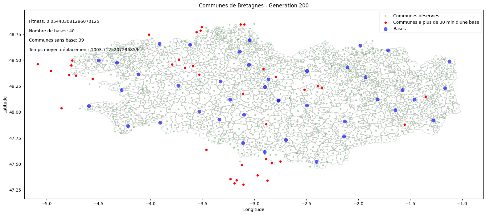

# Data Challenge 2023 Winner

[data-challenge.webm](https://github.com/CodyAdam/datachallenge2023/assets/60227150/e925bf78-98f6-49c1-8689-ac18846024b6)

**Première place** sur 18 équipes au Data Challenge 2023.

**L'Équipe** :
- Adam Cody
- Aussant Antoine 
- Delapart Thomas
- Delisle Juliette
- Larmet-Demenay Gwendal 


# Data Challenge 2023

Le Master Mathématiques Appliquées, Statistique (Universités de Rennes 1 et Rennes 2), le Master Monnaie, Banque, Finance Assurance (Université de Rennes 1), TAC ECONOMICS et l'association Rennes Data Science, organisent un data challenge les 20 et 21 janvier 2023 à la Faculté des Sciences Economiques de Rennes.

# Le problème

Voir les 2 sujets du data challenge [ici](documentation/challenge/documentation.pdf).

Nous avons choisi le sujet suivant : **Optimisation du positionnement des sites Enedis en Bretagne**.

# Notre solution



Animation des générations de notre algorithme génétique :


### Détail de notre solution [ici (`documentation/rapport_technique`)](documentation/rapport_technique.md).

### Structure du projet

```
📦datachallenge2023
 ┣ 📂data
 ┃ ┣ 📂bzh_shapefile                        // Shapefile de la Bretagne
 ┃ ┣ 📂img                                  // Plots Saved
 ┃ ┣ 📜communes_bre.csv
 ┃ ┣ 📜niveau_interventions.csv
 ┃ ┣ 📜niveau_interventions_improved.csv
 ┃ ┣ 📜temps_trajet30.csv
 ┃ ┗ 📜temps_trajet30_filtered.csv
 ┣ 📂documentation                          
 ┣ 📂src
 ┃ ┣ 📜data challenge_doc final.R           // Script R prétraitement
 ┃ ┣ 📜main.py                              // Programme principal
 ┃ ┣ 📜parse.py                             // Fonctions de traitement
 ┃ ┣ 📜genetic.py                           // Algorithme génétique
 ┃ ┗ 📜utils.py                             // Fonctions utilitaires
 ┣ 📜.gitignore
 ┣ 📜README.md
 ┗ 📜requirements.txt                       // packages Pythons nécessaires
 ```

# Installation et utilisation

## Prérequis

- Python 3.X
- Pip

Pour installer les packages nécessaires, exécuter la commande suivante :

```bash
pip install -r requirements.txt
```

## Utilisation

Pour lancer le programme, exécuter la commande suivante :

```bash
python main.py
```


# Les sponsors et partenaires

#### Un grand merci aux sponsors de l'événement


<a href="https://www.enedis.fr" target="_blank"></a> &nbsp;&nbsp; <a href="https://www.groupama.fr/" target="_blank"></a> &nbsp;&nbsp; <a href="https://fondation.univ-rennes.fr/" target="_blank"></a>

#### Ainsi qu'aux organisateurs et partenaires

<a href="https://eco.univ-rennes.fr/amsr" target="_blank"></a> &nbsp;&nbsp; <a href="https://eco.univ-rennes.fr/aerief" target="_blank"></a> &nbsp;&nbsp; <a href="https://www.univ-rennes.fr/" target="_blank"></a> &nbsp;&nbsp; <a href="https://taceconomics.com" target="_blank"></a>
