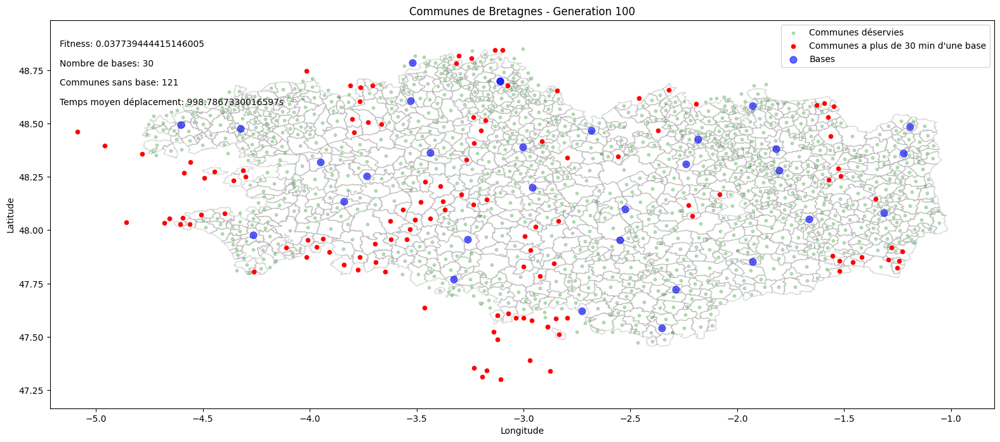
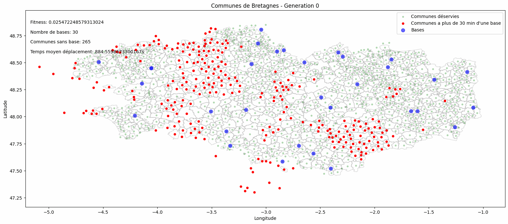
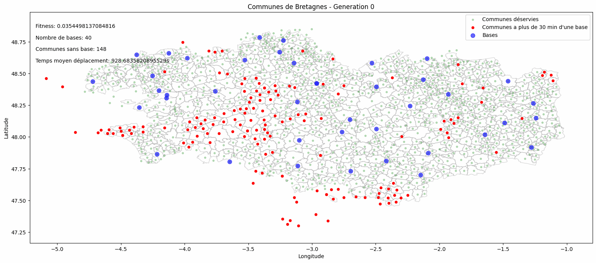

<!-- # Un document synthétique (par exemple un notebook) de 4 pages maximum 
expliquant leur démarche scientifique pour répondre au problème.  

- la difficulté du sujet  
- la qualité de l'analyse des données  
- l'adéquation des solutions IA envisagées avec la problématique  
- l'évaluation quantitative des performances des algorithmes utilisés  
- l'analyse de la complexité algorithmique des méthodes, la prise en considération du coût environnemental  
- la qualité de la restitution des résultats, des Livrables et de la présentation orale 
- l'ambition et la vision métier de la proposition finale. 
    -->
- [Introduction : la difficulté du sujet](#introduction--la-difficulté-du-sujet)
- [1. Traitement et analyse des données](#1-traitement-et-analyse-des-données)
  - [Prétraitement des données](#prétraitement-des-données)
  - [Traitement des données](#traitement-des-données)
  - [Optimisation du graphe](#optimisation-du-graphe)
- [2. Algorithme génétique](#2-algorithme-génétique)
- [3. Format d'un individu](#3-format-dun-individu)
- [4. Calcul du score de fitness](#4-calcul-du-score-de-fitness)
- [5. Génération de la population initiale](#5-génération-de-la-population-initiale)
- [6. Sélection des parents](#6-sélection-des-parents)
- [7. Croisement](#7-croisement)
- [8. Mutation](#8-mutation)
- [9. Sélection de la solution et répétition](#9-sélection-de-la-solution-et-répétition)
- [Solution optimale et analyse](#solution-optimale-et-analyse)
- [Démonstration](#démonstration)

# Introduction : la difficulté du sujet

Dans ce rapport, nous allons décrire notre démarche scientifique pour résoudre un problème d'optimisation complexe en utilisant un algorithme génétique. Le sujet en question est un problème sans solution finale connue, il faut donc trouver une solution qui soit proche de la solution optimale. 

Ce genre de problème se prête bien à une approche d'intelligence artificielle non supervisée, comme un **algorithme génétique**. 

# 1. Traitement et analyse des données    

## Prétraitement des données

Nous vons fait les prétraitement suivant sur les données :
- Filtrages des colonnes inutiles `communes_bre.csv`
- Filtrages des temps de trajets trop longs (> 30 min) `temps_trajet.csv`
- Discretisation des données en coefficient de pondération (`niveau_interventions.csv`)

Pour un détail de la démarche, voir le fichier [`prétraitement.md`](prétraitement.md) dans le dossier `documentation`.

## Traitement des données

Lecture des données csv qui ont été prétraitées. On transforme ensuite les données brut en un graphe non orienté pondéré avec :
  - **Les noeux** : les communes
  - **Les liens** : temps de trajet entre pair de communes
  - **Les poids** : Les niveaux d'interventions par commune

## Optimisation du graphe

Avec le graphe obtenu, on peut calculer le temps de trajet entre chaque commune à moins de 30 minutes entre elles. (fonction  `utils.optimize_edges`)
Cette algorithmie est basée sur l'algorithme de Dijkstra de recherche du plus court chemin.

Le but est de ne pas devoir à refaire le calcul à chaque calcul du fitness d'un individu.

# 2. Algorithme génétique

Un algorithme génétique utilise des concepts inspirés de la biologie, tels que la reproduction, la mutation et la sélection naturelle, pour résoudre des problèmes complexes.

Il a pour objectif de trouver une solution la plus approchée possible à un problème en générant des solutions potentielles (appelées individus) de manière aléatoire. L'ensemble des individus à une génération donnée forme la population.

A chaque génération, les individus sont mutés et évalués, ceux qui sont les plus adaptés sont sélectionnés pour la génération suivante.

Ce processus est répété plusieurs fois jusqu'à ce qu'une solution satisfaisante soit trouvée. On peut ainsi résoudre des problèmes difficiles qui ne peuvent pas être résolus simplement en testant toutes les possibilités tel que le problème traité ici.

# 3. Format d'un individu

Le format de données d'un individu est un graphe avec des liens entre les communes.
Pour le format de données des gènes, ils sont représenté par une liste d'index de communes. Chaque index de commune représente une base.

Avec ces genes nous pourrons calculer le score de "fitness" de l'individu. C'est à dire la qualité de la solution, plus le score est élevé, plus la solution est bonne.

# 4. Calcul du score de fitness

Le score de fitness est calculé par la **somme** des **temps de trajet entre toutes les communes et sa base la plus proche** (d'ou le besoin de l'optimisation). Les distance sont **pondérées** par le niveau d'intervention de la commune.
On inverse ensuite le résultat pour avoir un score de fitness plus élevé pour une solution de meilleure qualité.

# 5. Génération de la population initiale

Pour un nombre de bases fixée, on génère une population de taille 1000 individus. Chaque individu est une solution possible au problème. Chaque individu est un graphe avec des liens entre les communes. avec les bases placées au hasard sur des communes.

Durant la première génération, les individus sont générés de manière aléatoire.

# 6. Sélection des parents

On prendra ensuite les 10% des individus les plus adaptés pour la génération suivante (appelés parents).

On va ensuite générer des enfants à partir de ces parents. Pour cela, on va croiser des parents entre eux deux par deux pour créer des enfants jusqu'à ce qu'on ait retrouvé la taille de la population initiale.

# 7. Croisement

Lors d'une étape de croisement, on va généré un enfant à partir des deux parents sélectionnés. Pour cela, on va prendre un point de croisement aléatoire dans la liste des gènes des parents. On va ensuite prendre les gènes du premier parent jusqu'au point de croisement puis les gènes du second parent à partir du point de croisement.

Pour éviter les doublons, on va ensuite supprimer les doublons dans la liste des gènes de l'enfant. On va ensuite compléter la liste des gènes de l'enfant si elle est inférieure au nombre de bases initial.

# 8. Mutation

Pour chaque gene de chaque individu, on va appliquer une mutation avec une probabilité de $\frac{5}{\text{nombre de base}}$. Si la mutation est appliquée, on va choisir une nouvelle base voisine au hasard pour remplacer la base actuelle.

# 9. Sélection de la solution et répétition

Une fois l'étape terminée, on va afficher la solution la plus adaptée de la génération actuelle sur notre grafique puis répéter les étapes de sélection, croisement, mutation et sélection de la solution jusqu'à arrêter l'algorithme.

# Solution optimale et analyse

Nous obtenons ainsi la solution la plus optimale pour le problème à partir des données fournies, du nombre de bases choisi et du temps d'exécution de l'algorithme.

Le programme pourra être adapté pour trouver une solution différente si les utilisateurs rajoutes de nouvelles variables (difficulté de bouger les centres, satisfaction réelle des utilisateurs, etc...).

Pour choisir la solutions idéale, il faudrait se demander quelles le nombre de bases est le plus adapté pour le problème. Pour avec un rapport budget / temps de trajet le plus élevé possible.

**Avec 50 bases**, on obtient la solution la plus optimale en terme de temps de trajet moyen. Cependant, le cout est très élevé.

**Avec 30 bases**, on obtient une solution avec un temps de trajet moyen plus élevé mais un cout plus faible.

On a choisi comme solution finale de **40 bases**, car elle est plus résonnable en terme de cout et de temps de trajet moyen.

# Démonstration

**Pour 8 bases** 

**Pour 30 bases** 

**Pour 35 bases** 

**Pour 40 bases** 

**Pour 50 bases** 

Les résultats sont visibles sur dans ce dossier : [`data/img`](../data/img)